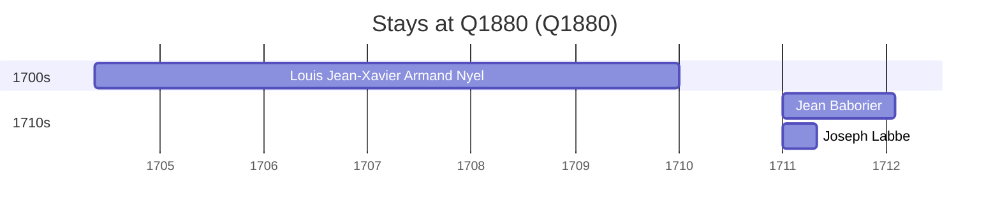

# Q1880

*(fetch error: HTTP Error 429: Too Many Requests)*

Wikidata: [Q1880](https://www.wikidata.org/wiki/Q1880)

3 occurrence(s) across 1 transcribed value(s), 3 person(s).

**Transcribed variants:**

- `Concépcion, Chile` (3×, 1704–1711)

| Date | Variant | Person | Type | Entity id | Real entity |
|------|---------|--------|------|-----------|-------------|
| 1704-05-13 | Concépcion, Chile | Louis Jean-Xavier Armand Nyel | chegada | [deh-louis-jean-xavier-armand-nyel](deh-louis-jean-xavier-armand-nyel) | — |
| 1711 | Concépcion, Chile | Joseph Labbe | estadia | [deh-joseph-labbe](deh-joseph-labbe) | — |
| 1711 | Concépcion, Chile | Jean Baborier | estadia | [deh-jean-baborier](deh-jean-baborier) | — |

### Co-presence

These persons were plausibly at this place during overlapping periods (interval estimation from stay dates; rough — see method note below).

| Period | Persons |
|--------|---------|
| 1710s | [Jean Baborier](deh-jean-baborier), [Joseph Labbe](deh-joseph-labbe) |

*1 overlapping pair(s) involving 2 person(s). Method: interval start = stay event date; end = next embarque/partida/different-place event, or death, or +15yr cap.*

