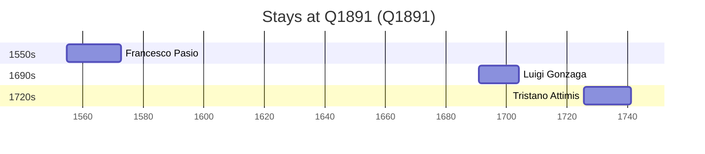

# Q1891

*(fetch error: HTTP Error 429: Too Many Requests)*

Wikidata: [Q1891](https://www.wikidata.org/wiki/Q1891)

3 occurrence(s) across 1 transcribed value(s), 3 person(s).

**Transcribed variants:**

- `Bolonha` (3×, 1554–1725)

| Date | Variant | Person | Type | Entity id | Real entity |
|------|---------|--------|------|-----------|-------------|
| 1554-11 | Bolonha | Francesco Pasio | nascimento | [deh-francesco-pasio](deh-francesco-pasio) | — |
| 1690-10-17 | Bolonha | Luigi Gonzaga | jesuita-entrada | [deh-luigi-gonzaga](deh-luigi-gonzaga) | — |
| 1725-07-28 | Bolonha | Tristano Attimis | jesuita-entrada | [deh-tristano-attimis](deh-tristano-attimis) | — |

