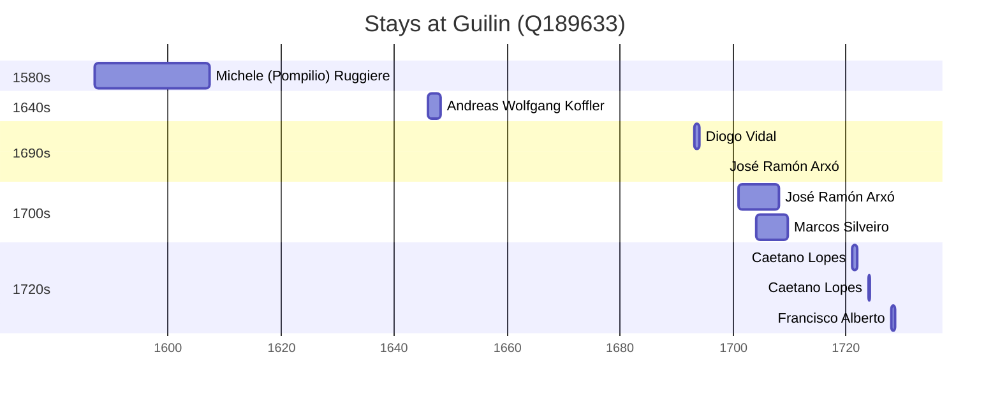

# Guilin (Q189633)

*prefecture-level city in Guangxi, China*

Wikidata: [Q189633](https://www.wikidata.org/wiki/Q189633)

11 occurrence(s) across 4 transcribed value(s), 8 person(s).

**Transcribed variants:**

- `Kweilin, Kouang-si` (4×, 1587–1706)
- `Kweilin, Kwangsi` (5×, 1646–1728)
- `Kweilin` (1×, 1698–1698)
- `Kweilin (Kouei-lin) fou, Kwangsi` (1×, undated)

| Date | Variant | Person | Type | Entity id | Real entity |
|------|---------|--------|------|-----------|-------------|
| — | Kweilin (Kouei-lin) fou, Kwangsi | Jean-Simon Bayard | estadia | [deh-jean-simon-bayard](deh-jean-simon-bayard) | — |
| 1587 | Kweilin, Kouang-si | Michele (Pompilio) Ruggiere | estadia | [deh-michele-ruggiere](deh-michele-ruggiere) | — |
| 1646 | Kweilin, Kwangsi | Andreas Wolfgang Koffler | estadia | [deh-andreas-wolfgang-koffler](deh-andreas-wolfgang-koffler) | — |
| 1693-01-09 | Kweilin, Kouang-si | Diogo Vidal | estadia | [deh-diogo-vidal](deh-diogo-vidal) | — |
| 1698-04-03 | Kweilin | José Ramón Arxó | estadia | [deh-jose-ramon-arxo](deh-jose-ramon-arxo) | — |
| 1701 | Kweilin, Kwangsi | José Ramón Arxó | estadia | [deh-jose-ramon-arxo](deh-jose-ramon-arxo) | — |
| 1704 | Kweilin, Kouang-si | Marcos Silveiro | estadia | [deh-marcos-silveiro](deh-marcos-silveiro) | — |
| 1706 | Kweilin, Kouang-si | Marcos Silveiro | estadia | [deh-marcos-silveiro](deh-marcos-silveiro) | — |
| 1721 | Kweilin, Kwangsi | Caetano Lopes | estadia | [deh-caetano-lopes](deh-caetano-lopes) | — |
| 1724 | Kweilin, Kwangsi | Caetano Lopes | estadia | [deh-caetano-lopes](deh-caetano-lopes) | — |
| 1728 | Kweilin, Kwangsi | Francisco Alberto | estadia | [deh-francisco-alberto](deh-francisco-alberto) | — |

### Co-presence

These persons were plausibly at this place during overlapping periods (interval estimation from stay dates; rough — see method note below).

| Period | Persons |
|--------|---------|
| 1700s | [José Ramón Arxó](deh-jose-ramon-arxo), [Marcos Silveiro](deh-marcos-silveiro) |

*1 overlapping pair(s) involving 2 person(s). Method: interval start = stay event date; end = next embarque/partida/different-place event, or death, or +15yr cap.*

