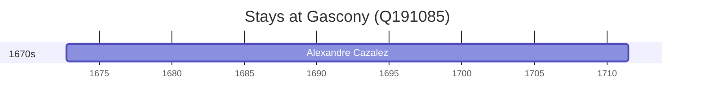

# Gascony (Q191085)

*former French territory*

Wikidata: [Q191085](https://www.wikidata.org/wiki/Q191085)

1 occurrence(s) across 1 transcribed value(s), 1 person(s).

**Transcribed variants:**

- `?` (1×, 1672–1672)

| Date | Variant | Person | Type | Entity id | Real entity |
|------|---------|--------|------|-----------|-------------|
| 1672-09-27 | ? | Alexandre Cazalez | nascimento | [deh-alexandre-cazalez](deh-alexandre-cazalez) | — |

