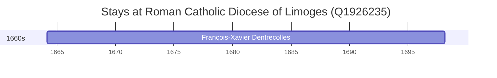

# Roman Catholic Diocese of Limoges (Q1926235)

*diocese of the Catholic Church in France*

Wikidata: [Q1926235](https://www.wikidata.org/wiki/Q1926235)

1 occurrence(s) across 1 transcribed value(s), 1 person(s).

**Transcribed variants:**

- `Diocese de Limoges` (1×, 1664–1664)

| Date | Variant | Person | Type | Entity id | Real entity |
|------|---------|--------|------|-----------|-------------|
| 1664-02-25 | Diocese de Limoges | François-Xavier Dentrecolles | nascimento | [deh-francois-xavier-dentrecolles](deh-francois-xavier-dentrecolles) | — |

