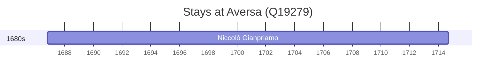

# Aversa (Q19279)

*Italian comune*

Wikidata: [Q19279](https://www.wikidata.org/wiki/Q19279)

1 occurrence(s) across 1 transcribed value(s), 1 person(s).

**Transcribed variants:**

- `Aversa, Itália` (1×, 1686–1686)

| Date | Variant | Person | Type | Entity id | Real entity |
|------|---------|--------|------|-----------|-------------|
| 1686-10-22 | Aversa, Itália | Niccolò Gianpriamo | nascimento | [deh-niccolo-gianpriamo](deh-niccolo-gianpriamo) | — |

