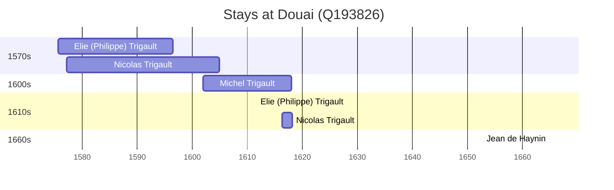

# Douai (Q193826)

*commune in Nord, France*

Wikidata: [Q193826](https://www.wikidata.org/wiki/Q193826)

8 occurrence(s) across 1 transcribed value(s), 5 person(s).

**Transcribed variants:**

- `Douai` (8×, 1575–1665)

| Date | Variant | Person | Type | Entity id | Real entity |
|------|---------|--------|------|-----------|-------------|
| — | Douai | François Noël | estadia | [deh-francois-noel](deh-francois-noel) | — |
| 1575-09 | Douai | Elie (Philippe) Trigault | nascimento | [deh-eli-philippe-trigault](deh-eli-philippe-trigault) | — |
| 1577-03-03 | Douai | Nicolas Trigault | nascimento | [deh-nicolas-trigault](deh-nicolas-trigault) | — |
| 1594-11-09 | Douai | Nicolas Trigault | jesuita-entrada | [deh-nicolas-trigault](deh-nicolas-trigault) | — |
| 1602 | Douai | Michel Trigault | nascimento | [deh-michel-trigault](deh-michel-trigault) | — |
| 1611-10-13 | Douai | Elie (Philippe) Trigault | jesuita-votos-local | [deh-eli-philippe-trigault](deh-eli-philippe-trigault) | — |
| 1665 | Douai | Jean de Haynin | jesuita-ordenacao-padre | [deh-jean-de-haynin](deh-jean-de-haynin) | — |
| >1616-05 | Douai | Nicolas Trigault | estadia | [deh-nicolas-trigault](deh-nicolas-trigault) | — |

### Co-presence

These persons were plausibly at this place during overlapping periods (interval estimation from stay dates; rough — see method note below).

| Period | Persons |
|--------|---------|
| 1570s | [Elie (Philippe) Trigault](deh-eli-philippe-trigault), [Nicolas Trigault](deh-nicolas-trigault) |
| 1600s | [Michel Trigault](deh-michel-trigault), [Nicolas Trigault](deh-nicolas-trigault) |
| 1610s | [Elie (Philippe) Trigault](deh-eli-philippe-trigault), [Michel Trigault](deh-michel-trigault), [Nicolas Trigault](deh-nicolas-trigault) |

*4 overlapping pair(s) involving 3 person(s). Method: interval start = stay event date; end = next embarque/partida/different-place event, or death, or +15yr cap.*

