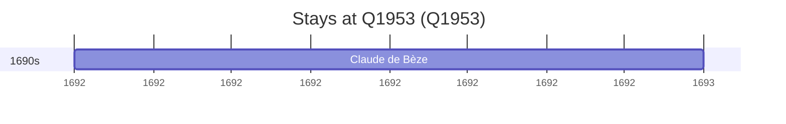

# Q1953

*(fetch error: HTTP Error 429: Too Many Requests)*

Wikidata: [Q1953](https://www.wikidata.org/wiki/Q1953)

1 occurrence(s) across 1 transcribed value(s), 1 person(s).

**Transcribed variants:**

- `Yerevan` (1×, 1692–1692)

| Date | Variant | Person | Type | Entity id | Real entity |
|------|---------|--------|------|-----------|-------------|
| 1692-05 | Yerevan | Claude de Bèze | estadia | [deh-claude-de-beze](deh-claude-de-beze) | — |

