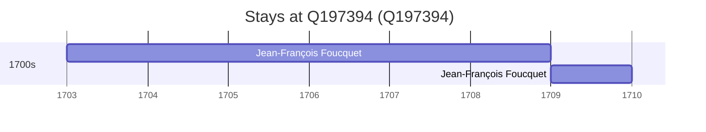

# Q197394

*(fetch error: HTTP Error 429: Too Many Requests)*

Wikidata: [Q197394](https://www.wikidata.org/wiki/Q197394)

2 occurrence(s) across 2 transcribed value(s), 1 person(s).

**Transcribed variants:**

- `Liankiang fou, Kiangsi` (1×, 1703–1703)
- `Linkiang fou` (1×, 1709–1709)

| Date | Variant | Person | Type | Entity id | Real entity |
|------|---------|--------|------|-----------|-------------|
| 1703 | Liankiang fou, Kiangsi | Jean-François Foucquet | estadia | [deh-jean-francois-foucquet](deh-jean-francois-foucquet) | — |
| 1709 | Linkiang fou | Jean-François Foucquet | estadia | [deh-jean-francois-foucquet](deh-jean-francois-foucquet) | — |

