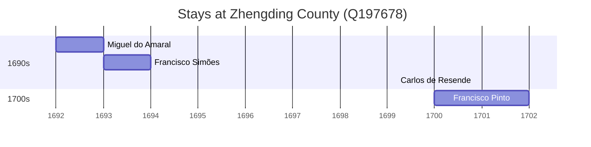

# Zhengding County (Q197678)

*county in the Shijiazhuang prefecture of Hebei, China*

Wikidata: [Q197678](https://www.wikidata.org/wiki/Q197678)

5 occurrence(s) across 5 transcribed value(s), 4 person(s).

**Transcribed variants:**

- `Chengting fou, Hopei` (1×, 1692–1692)
- `Chengting (Tcheng-ting fou, Hopei)` (1×, 1693–1693)
- `Chengting` (1×, 1699–1699)
- `Cheng-ting fou` (1×, 1700–1700)
- `Chengting (Tcheng-ting fou)` (1×, undated)

| Date | Variant | Person | Type | Entity id | Real entity |
|------|---------|--------|------|-----------|-------------|
| — | Chengting (Tcheng-ting fou) | Carlos de Resende | estadia | [deh-carlos-de-resende](deh-carlos-de-resende) | — |
| 1692 | Chengting fou, Hopei | Miguel do Amaral | estadia | [deh-miguel-do-amaral](deh-miguel-do-amaral) | [rp086368](rp086368) |
| 1693 | Chengting (Tcheng-ting fou, Hopei) | Francisco Simões | estadia | [deh-francisco-simoes](deh-francisco-simoes) | — |
| 1699-03-15 | Chengting | Carlos de Resende | jesuita-votos-local | [deh-carlos-de-resende](deh-carlos-de-resende) | — |
| 1700 | Cheng-ting fou | Francisco Pinto | estadia | [deh-francisco-pinto-i](deh-francisco-pinto-i) | — |

