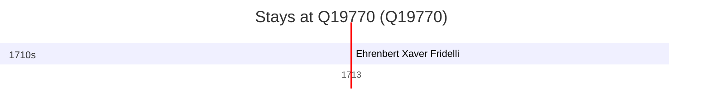

# Q19770

*(fetch error: HTTP Error 429: Too Many Requests)*

Wikidata: [Q19770](https://www.wikidata.org/wiki/Q19770)

2 occurrence(s) across 1 transcribed value(s), 2 person(s).

**Transcribed variants:**

- `Szechwan` (2×, 1713–1713)

| Date | Variant | Person | Type | Entity id | Real entity |
|------|---------|--------|------|-----------|-------------|
| — | Szechwan | Félix da Rocha | estadia | [deh-felix-da-rocha](deh-felix-da-rocha) | — |
| 1713 | Szechwan | Ehrenbert Xaver Fridelli | estadia | [deh-ehrenbert-xaver-fridelli](deh-ehrenbert-xaver-fridelli) | — |

