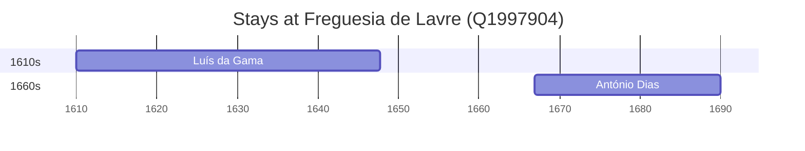

# Freguesia de Lavre (Q1997904)

*civil parish in Portugal*

Wikidata: [Q1997904](https://www.wikidata.org/wiki/Q1997904)

2 occurrence(s) across 1 transcribed value(s), 2 person(s).

**Transcribed variants:**

- `Lavre, diocese de Évora` (2×, 1610–1666)

| Date | Variant | Person | Type | Entity id | Real entity |
|------|---------|--------|------|-----------|-------------|
| 1610 | Lavre, diocese de Évora | Luís da Gama | nascimento | [deh-luis-da-gama](deh-luis-da-gama) | — |
| 1666-12-12 | Lavre, diocese de Évora | António Dias | nascimento | [deh-antonio-dias](deh-antonio-dias) | — |

