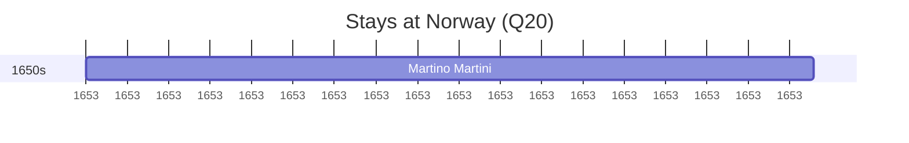

# Norway (Q20)

*country in Northern Europe*

Wikidata: [Q20](https://www.wikidata.org/wiki/Q20)

1 occurrence(s) across 1 transcribed value(s), 1 person(s).

**Transcribed variants:**

- `Noruega` (1×, 1653–1653)

| Date | Variant | Person | Type | Entity id | Real entity |
|------|---------|--------|------|-----------|-------------|
| 1653-08-31 | Noruega | Martino Martini | estadia | [deh-martino-martini](deh-martino-martini) | — |

