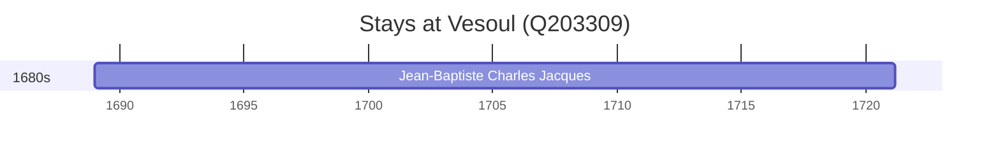

# Vesoul (Q203309)

*commune in Haute-Saône, France*

Wikidata: [Q203309](https://www.wikidata.org/wiki/Q203309)

1 occurrence(s) across 1 transcribed value(s), 1 person(s).

**Transcribed variants:**

- `Vesoul, Franche-Comté` (1×, 1688–1688)

| Date | Variant | Person | Type | Entity id | Real entity |
|------|---------|--------|------|-----------|-------------|
| 1688-12-27 | Vesoul, Franche-Comté | Jean-Baptiste Charles Jacques | nascimento | [deh-jean-baptiste-charles-jacques](deh-jean-baptiste-charles-jacques) | — |

