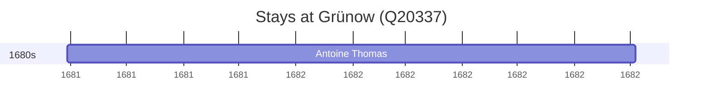

# Grünow (Q20337)

*municipality in Mecklenburg-Vorpommern, Germany*

Wikidata: [Q20337](https://www.wikidata.org/wiki/Q20337)

1 occurrence(s) across 1 transcribed value(s), 1 person(s).

**Transcribed variants:**

- `Juthia, Sião` (1×, 1681–1681)

| Date | Variant | Person | Type | Entity id | Real entity |
|------|---------|--------|------|-----------|-------------|
| 1681-08-30 | Juthia, Sião | Antoine Thomas | chegada | [deh-antoine-thomas](deh-antoine-thomas) | [rp486350](rp486350) |

