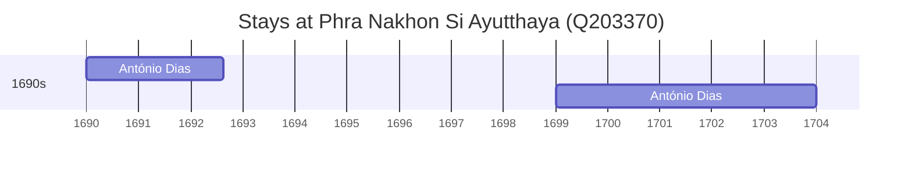

# Phra Nakhon Si Ayutthaya (Q203370)

*city in Phra Nakhon Si Ayutthaya province, Thailand*

Wikidata: [Q203370](https://www.wikidata.org/wiki/Q203370)

2 occurrence(s) across 1 transcribed value(s), 1 person(s).

**Transcribed variants:**

- `Juthia, Sião` (2×, 1690–1699)

| Date | Variant | Person | Type | Entity id | Real entity |
|------|---------|--------|------|-----------|-------------|
| 1690 | Juthia, Sião | António Dias | estadia | [deh-antonio-dias](deh-antonio-dias) | — |
| 1699 | Juthia, Sião | António Dias | estadia | [deh-antonio-dias](deh-antonio-dias) | — |

