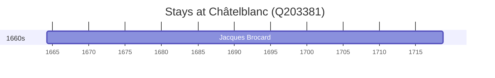

# Châtelblanc (Q203381)

*commune in Doubs, France*

Wikidata: [Q203381](https://www.wikidata.org/wiki/Q203381)

1 occurrence(s) across 1 transcribed value(s), 1 person(s).

**Transcribed variants:**

- `Chatelblanc, Doubs, diocese de Besançon` (1×, 1664–1664)

| Date | Variant | Person | Type | Entity id | Real entity |
|------|---------|--------|------|-----------|-------------|
| 1664-03-21 | Chatelblanc, Doubs, diocese de Besançon | Jacques Brocard | nascimento | [deh-jacques-brocard](deh-jacques-brocard) | [rp808798](rp808798) |

