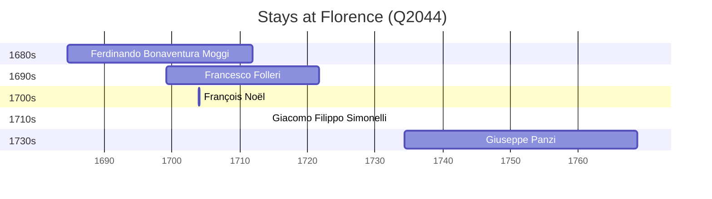

# Florence (Q2044)

*Italian city and commune, located in Tuscany*

Wikidata: [Q2044](https://www.wikidata.org/wiki/Q2044)

7 occurrence(s) across 2 transcribed value(s), 6 person(s).

**Transcribed variants:**

- `Florença` (6×, 1684–1734)
- `Florença (oratório de S. Giovanni Battista)` (1×, 1734–1734)

| Date | Variant | Person | Type | Entity id | Real entity |
|------|---------|--------|------|-----------|-------------|
| — | Florença | Johann Grueber | estadia | [deh-johann-grueber](deh-johann-grueber) | — |
| 1684-07-13 | Florença | Ferdinando Bonaventura Moggi | nascimento | [deh-ferdinando-bonaventura-moggi](deh-ferdinando-bonaventura-moggi) | — |
| 1699-02-09 | Florença | Francesco Folleri | nascimento | [deh-francesco-folleri](deh-francesco-folleri) | [rp233776](rp233776) |
| 1703-12-02 | Florença | François Noël | estadia | [deh-francois-noel](deh-francois-noel) | — |
| 1714-02-02 | Florença | Giacomo Filippo Simonelli | jesuita-votos-local | [deh-giacomo-filippo-simonelli](deh-giacomo-filippo-simonelli) | — |
| 1734-05-02 | Florença | Giuseppe Panzi | nascimento | [deh-giuseppe-panzi](deh-giuseppe-panzi) | — |
| 1734-05-04 | Florença (oratório de S. Giovanni Battista) | Giuseppe Panzi | baptizado | [deh-giuseppe-panzi](deh-giuseppe-panzi) | — |

### Co-presence

These persons were plausibly at this place during overlapping periods (interval estimation from stay dates; rough — see method note below).

| Period | Persons |
|--------|---------|
| 1690s | [Ferdinando Bonaventura Moggi](deh-ferdinando-bonaventura-moggi), [Francesco Folleri](rp233776) |
| 1700s | [Ferdinando Bonaventura Moggi](deh-ferdinando-bonaventura-moggi), [Francesco Folleri](rp233776), [François Noël](deh-francois-noel) |
| 1710s | [Francesco Folleri](rp233776), [Giacomo Filippo Simonelli](deh-giacomo-filippo-simonelli) |

*4 overlapping pair(s) involving 4 person(s). Method: interval start = stay event date; end = next embarque/partida/different-place event, or death, or +15yr cap.*

