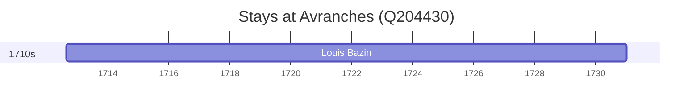

# Avranches (Q204430)

*commune in Manche, France*

Wikidata: [Q204430](https://www.wikidata.org/wiki/Q204430)

1 occurrence(s) across 1 transcribed value(s), 1 person(s).

**Transcribed variants:**

- `região d'Avranches` (1×, 1712–1712)

| Date | Variant | Person | Type | Entity id | Real entity |
|------|---------|--------|------|-----------|-------------|
| 1712-08-24 | região d'Avranches | Louis Bazin | nascimento | [deh-louis-bazin](deh-louis-bazin) | — |

