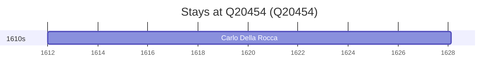

# Q20454

*(fetch error: HTTP Error 429: Too Many Requests)*

Wikidata: [Q20454](https://www.wikidata.org/wiki/Q20454)

1 occurrence(s) across 1 transcribed value(s), 1 person(s).

**Transcribed variants:**

- `Saluces, Piemonte` (1×, 1612–1612)

| Date | Variant | Person | Type | Entity id | Real entity |
|------|---------|--------|------|-----------|-------------|
| 1612 | Saluces, Piemonte | Carlo Della Rocca | nascimento | [deh-carlo-della-rocca](deh-carlo-della-rocca) | — |

