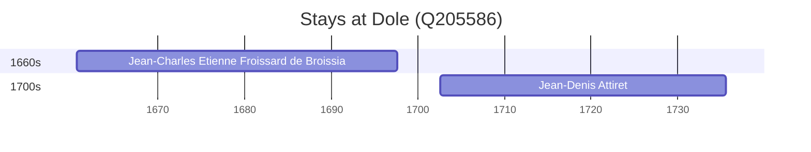

# Dole (Q205586)

*commune in Jura, France*

Wikidata: [Q205586](https://www.wikidata.org/wiki/Q205586)

2 occurrence(s) across 1 transcribed value(s), 2 person(s).

**Transcribed variants:**

- `Dole, Jura` (2×, 1660–1702)

| Date | Variant | Person | Type | Entity id | Real entity |
|------|---------|--------|------|-----------|-------------|
| 1660-08-10 | Dole, Jura | Jean-Charles Etienne Froissard de Broissia | nascimento | [deh-jean-charles-etienne-froissard-de-broissia](deh-jean-charles-etienne-froissard-de-broissia) | — |
| 1702-07-31 | Dole, Jura | Jean-Denis Attiret | nascimento | [deh-jean-denis-attiret](deh-jean-denis-attiret) | — |

