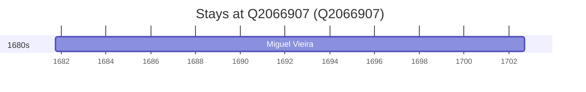

# Q2066907

*(fetch error: HTTP Error 429: Too Many Requests)*

Wikidata: [Q2066907](https://www.wikidata.org/wiki/Q2066907)

1 occurrence(s) across 1 transcribed value(s), 1 person(s).

**Transcribed variants:**

- `Pedroso, diocese do Porto` (1×, 1681–1681)

| Date | Variant | Person | Type | Entity id | Real entity |
|------|---------|--------|------|-----------|-------------|
| 1681-09-29 | Pedroso, diocese do Porto | Miguel Vieira | nascimento | [deh-miguel-vieira](deh-miguel-vieira) | — |

