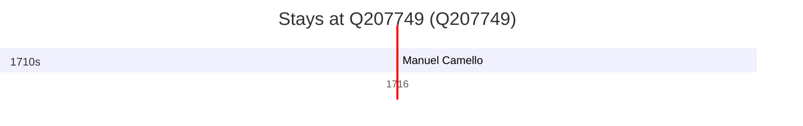

# Q207749

*(fetch error: HTTP Error 429: Too Many Requests)*

Wikidata: [Q207749](https://www.wikidata.org/wiki/Q207749)

1 occurrence(s) across 1 transcribed value(s), 1 person(s).

**Transcribed variants:**

- `Tanna (colégio)` (1×, 1716–1716)

| Date | Variant | Person | Type | Entity id | Real entity |
|------|---------|--------|------|-----------|-------------|
| 1716-12-13 | Tanna (colégio) | Manuel Camello | jesuita-votos-local | [deh-manuel-camello](deh-manuel-camello) | — |

