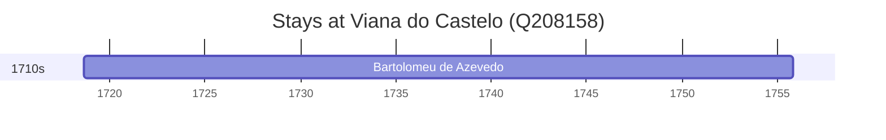

# Viana do Castelo (Q208158)

*municipality in Portugal*

Wikidata: [Q208158](https://www.wikidata.org/wiki/Q208158)

1 occurrence(s) across 1 transcribed value(s), 1 person(s).

**Transcribed variants:**

- `Viana do Castelo` (1×, 1718–1718)

| Date | Variant | Person | Type | Entity id | Real entity |
|------|---------|--------|------|-----------|-------------|
| 1718-08-24 | Viana do Castelo | Bartolomeu de Azevedo | nascimento | [deh-bartolomeu-de-azevedo](deh-bartolomeu-de-azevedo) | — |

