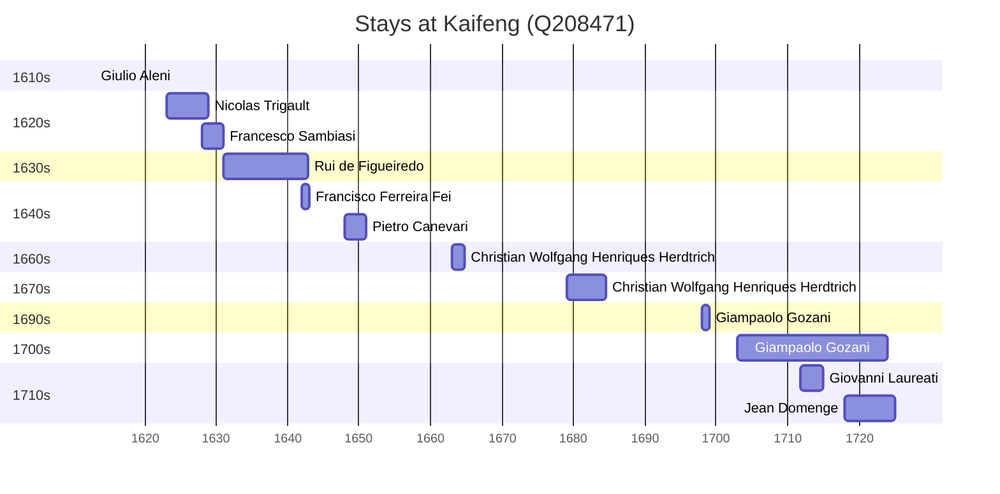

# Kaifeng (Q208471)

*prefecture-level city in Henan, China, a former capital of China*

Wikidata: [Q208471](https://www.wikidata.org/wiki/Q208471)

16 occurrence(s) across 8 transcribed value(s), 10 person(s).

**Transcribed variants:**

- `Honan, Kaifeng (K'ai-fong fou)` (1×, 1623–1623)
- `Kaifeng, Honan` (2×, 1628–1631)
- `K'ai-fong fou` (1×, 1642–1642)
- `Kaifeng (K'ai-fong fou)` (1×, 1642–1642)
- `Kaifeng` (7×, 1648–1722)
- `Kaifeng, K'ai-fong fou, Honan` (1×, 1663–1663)
- `Kaifeng (K'ai-fong fou) (sinagoga)` (2×, 1698–1718)
- `Kaifeng, K'ai-fong fou (sinagoga)` (1×, undated)

| Date | Variant | Person | Type | Entity id | Real entity |
|------|---------|--------|------|-----------|-------------|
| 1623 | Honan, Kaifeng (K'ai-fong fou) | Nicolas Trigault | estadia | [deh-nicolas-trigault](deh-nicolas-trigault) | — |
| 1628 | Kaifeng, Honan | Francesco Sambiasi | estadia | [deh-francesco-sambiasi](deh-francesco-sambiasi) | — |
| 1631 | Kaifeng, Honan | Rui de Figueiredo | estadia | [deh-rui-de-figueiredo](deh-rui-de-figueiredo) | — |
| 1642 | Kaifeng (K'ai-fong fou) | Francisco Ferreira Fei | estadia | [deh-francisco-ferreira-fei](deh-francisco-ferreira-fei) | — |
| 1642-10-09 | K'ai-fong fou | Rui de Figueiredo | morte | [deh-rui-de-figueiredo](deh-rui-de-figueiredo) | — |
| 1648 | Kaifeng | Pietro Canevari | estadia | [deh-pietro-canevari](deh-pietro-canevari) | — |
| 1663 | Kaifeng, K'ai-fong fou, Honan | Christian Wolfgang Henriques Herdtrich | estadia | [deh-christian-wolfgang-henriques-herdtrich](deh-christian-wolfgang-henriques-herdtrich) | [rp669413](rp669413) |
| 1679 | Kaifeng | Christian Wolfgang Henriques Herdtrich | estadia | [deh-christian-wolfgang-henriques-herdtrich](deh-christian-wolfgang-henriques-herdtrich) | [rp669413](rp669413) |
| 1698 | Kaifeng (K'ai-fong fou) (sinagoga) | Giampaolo Gozani | estadia | [deh-giampaolo-gozani](deh-giampaolo-gozani) | — |
| 1703 | Kaifeng | Giampaolo Gozani | estadia | [deh-giampaolo-gozani](deh-giampaolo-gozani) | — |
| 1711 | Kaifeng | Giampaolo Gozani | estadia | [deh-giampaolo-gozani](deh-giampaolo-gozani) | — |
| 1711-10 | Kaifeng | Giovanni Laureati | estadia | [deh-giovanni-laureati](deh-giovanni-laureati) | [rp323905](rp323905) |
| 1713 | Kaifeng | Giampaolo Gozani | estadia | [deh-giampaolo-gozani](deh-giampaolo-gozani) | — |
| 1718 | Kaifeng (K'ai-fong fou) (sinagoga) | Jean Domenge | estadia | [deh-jean-domenge](deh-jean-domenge) | — |
| 1722 | Kaifeng | Giampaolo Gozani | estadia | [deh-giampaolo-gozani](deh-giampaolo-gozani) | — |
| >1613:<1619 | Kaifeng, K'ai-fong fou (sinagoga) | Giulio Aleni | estadia | [deh-giulio-aleni](deh-giulio-aleni) | — |

### Co-presence

These persons were plausibly at this place during overlapping periods (interval estimation from stay dates; rough — see method note below).

| Period | Persons |
|--------|---------|
| 1620s | [Francesco Sambiasi](deh-francesco-sambiasi), [Nicolas Trigault](deh-nicolas-trigault) |
| 1640s | [Francisco Ferreira Fei](deh-francisco-ferreira-fei), [Rui de Figueiredo](deh-rui-de-figueiredo) |
| 1710s | [Giampaolo Gozani](deh-giampaolo-gozani), [Giovanni Laureati](rp323905), [Jean Domenge](deh-jean-domenge) |

*4 overlapping pair(s) involving 7 person(s). Method: interval start = stay event date; end = next embarque/partida/different-place event, or death, or +15yr cap.*

