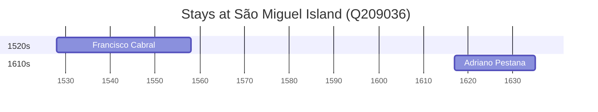

# São Miguel Island (Q209036)

*island in the Portuguese archipelago of the Azores*

Wikidata: [Q209036](https://www.wikidata.org/wiki/Q209036)

2 occurrence(s) across 1 transcribed value(s), 2 person(s).

**Transcribed variants:**

- `Ilha de S. Miguel, Açores` (2×, 1528–1617)

| Date | Variant | Person | Type | Entity id | Real entity |
|------|---------|--------|------|-----------|-------------|
| 1528 | Ilha de S. Miguel, Açores | Francisco Cabral | nascimento | [deh-francisco-cabral](deh-francisco-cabral) | [rp400649](rp400649) |
| 1617 | Ilha de S. Miguel, Açores | Adriano Pestana | nascimento | [deh-adriano-pestana](deh-adriano-pestana) | — |

