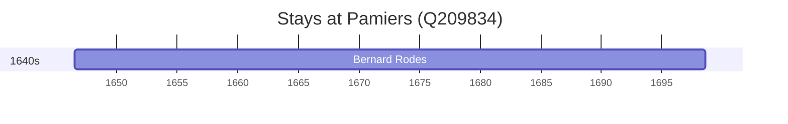

# Pamiers (Q209834)

*commune in Ariège, France*

Wikidata: [Q209834](https://www.wikidata.org/wiki/Q209834)

1 occurrence(s) across 1 transcribed value(s), 1 person(s).

**Transcribed variants:**

- `Pamiers` (1×, 1646–1646)

| Date | Variant | Person | Type | Entity id | Real entity |
|------|---------|--------|------|-----------|-------------|
| 1646-07-15 | Pamiers | Bernard Rodes | nascimento | [deh-bernard-rodes](deh-bernard-rodes) | — |

