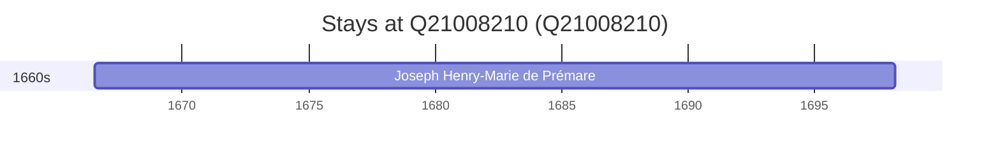

# Q21008210

*(fetch error: HTTP Error 429: Too Many Requests)*

Wikidata: [Q21008210](https://www.wikidata.org/wiki/Q21008210)

1 occurrence(s) across 1 transcribed value(s), 1 person(s).

**Transcribed variants:**

- `Cherbourg` (1×, 1666–1666)

| Date | Variant | Person | Type | Entity id | Real entity |
|------|---------|--------|------|-----------|-------------|
| 1666-07-17 | Cherbourg | Joseph Henry-Marie de Prémare | nascimento | [deh-joseph-henry-marie-de-premare](deh-joseph-henry-marie-de-premare) | — |

