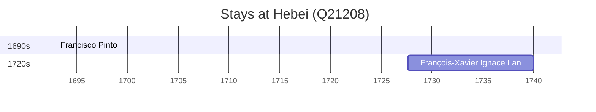

# Hebei (Q21208)

*province of China*

Wikidata: [Q21208](https://www.wikidata.org/wiki/Q21208)

3 occurrence(s) across 2 transcribed value(s), 3 person(s).

**Transcribed variants:**

- `Ho-pei` (1×, 1693–1693)
- `Hopei` (2×, 1727–1727)

| Date | Variant | Person | Type | Entity id | Real entity |
|------|---------|--------|------|-----------|-------------|
| — | Hopei | Louis Fan | estadia | [deh-louis-fan](deh-louis-fan) | — |
| 1693 | Ho-pei | Francisco Pinto | estadia | [deh-francisco-pinto-i](deh-francisco-pinto-i) | — |
| 1727-08-23 | Hopei | François-Xavier Ignace Lan | nascimento | [deh-francois-xavier-ignace-lan](deh-francois-xavier-ignace-lan) | — |

