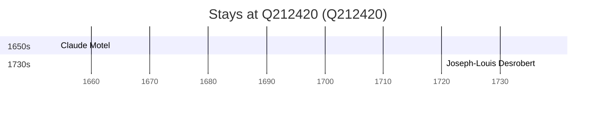

# Q212420

*(fetch error: HTTP Error 429: Too Many Requests)*

Wikidata: [Q212420](https://www.wikidata.org/wiki/Q212420)

2 occurrence(s) across 1 transcribed value(s), 2 person(s).

**Transcribed variants:**

- `Sens` (2×, 1654–1736)

| Date | Variant | Person | Type | Entity id | Real entity |
|------|---------|--------|------|-----------|-------------|
| 1654-02-22 | Sens | Claude Motel | jesuita-votos-local | [deh-claude-motel](deh-claude-motel) | — |
| 1736-08-15 | Sens | Joseph-Louis Desrobert | jesuita-votos-local | [deh-joseph-louis-desrobert](deh-joseph-louis-desrobert) | — |

