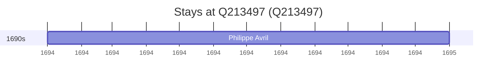

# Q213497

*(fetch error: HTTP Error 429: Too Many Requests)*

Wikidata: [Q213497](https://www.wikidata.org/wiki/Q213497)

1 occurrence(s) across 1 transcribed value(s), 1 person(s).

**Transcribed variants:**

- `Fontenay-le-Comte` (1×, 1694–1694)

| Date | Variant | Person | Type | Entity id | Real entity |
|------|---------|--------|------|-----------|-------------|
| 1694 | Fontenay-le-Comte | Philippe Avril | estadia | [deh-philippe-avril](deh-philippe-avril) | [rp636254](rp636254) |

