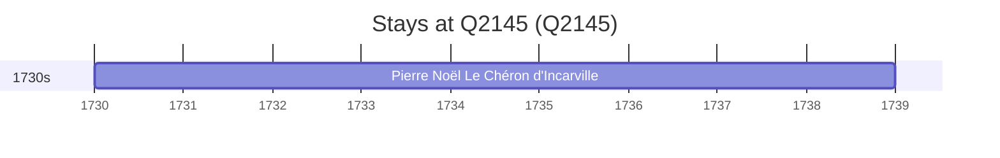

# Q2145

*(fetch error: HTTP Error 429: Too Many Requests)*

Wikidata: [Q2145](https://www.wikidata.org/wiki/Q2145)

1 occurrence(s) across 1 transcribed value(s), 1 person(s).

**Transcribed variants:**

- `Québec` (1×, 1730–1730)

| Date | Variant | Person | Type | Entity id | Real entity |
|------|---------|--------|------|-----------|-------------|
| 1730:1739 | Québec | Pierre Noël Le Chéron d'Incarville | estadia | [deh-pierre-noel-le-cheron-dincarville](deh-pierre-noel-le-cheron-dincarville) | — |

