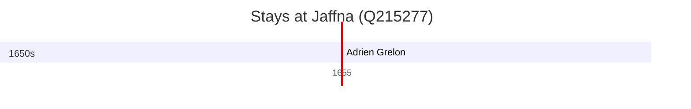

# Jaffna (Q215277)

*capital city of the Northern Province of Sri Lanka*

Wikidata: [Q215277](https://www.wikidata.org/wiki/Q215277)

1 occurrence(s) across 1 transcribed value(s), 1 person(s).

**Transcribed variants:**

- `Iafanapàtaniae, Ceilão` (1×, 1655–1655)

| Date | Variant | Person | Type | Entity id | Real entity |
|------|---------|--------|------|-----------|-------------|
| 1655-06-21 | Iafanapàtaniae, Ceilão | Adrien Grelon | jesuita-votos-local | [deh-adrien-grelon](deh-adrien-grelon) | — |

