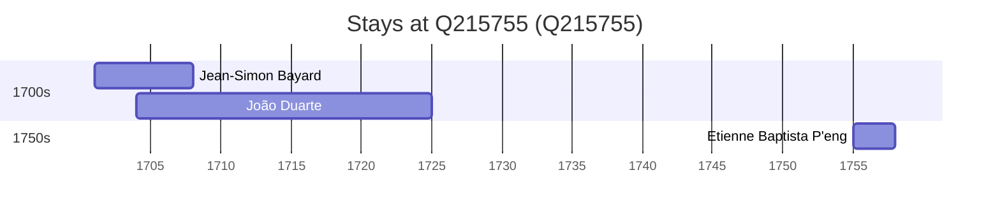

# Q215755

*(fetch error: HTTP Error 429: Too Many Requests)*

Wikidata: [Q215755](https://www.wikidata.org/wiki/Q215755)

3 occurrence(s) across 3 transcribed value(s), 3 person(s).

**Transcribed variants:**

- `Siangtan` (1×, 1701–1701)
- `Siangtan, Hunan` (1×, 1704–1704)
- `Siangtan (Siang-t'an) Hunan` (1×, 1755–1755)

| Date | Variant | Person | Type | Entity id | Real entity |
|------|---------|--------|------|-----------|-------------|
| 1701 | Siangtan | Jean-Simon Bayard | estadia | [deh-jean-simon-bayard](deh-jean-simon-bayard) | — |
| 1704 | Siangtan, Hunan | João Duarte | estadia | [deh-joao-duarte](deh-joao-duarte) | — |
| 1755 | Siangtan (Siang-t'an) Hunan | Etienne Baptista P'eng | estadia | [deh-etienne-baptista-peng](deh-etienne-baptista-peng) | — |

### Co-presence

These persons were plausibly at this place during overlapping periods (interval estimation from stay dates; rough — see method note below).

| Period | Persons |
|--------|---------|
| 1700s | [Jean-Simon Bayard](deh-jean-simon-bayard), [João Duarte](deh-joao-duarte) |

*1 overlapping pair(s) involving 2 person(s). Method: interval start = stay event date; end = next embarque/partida/different-place event, or death, or +15yr cap.*

