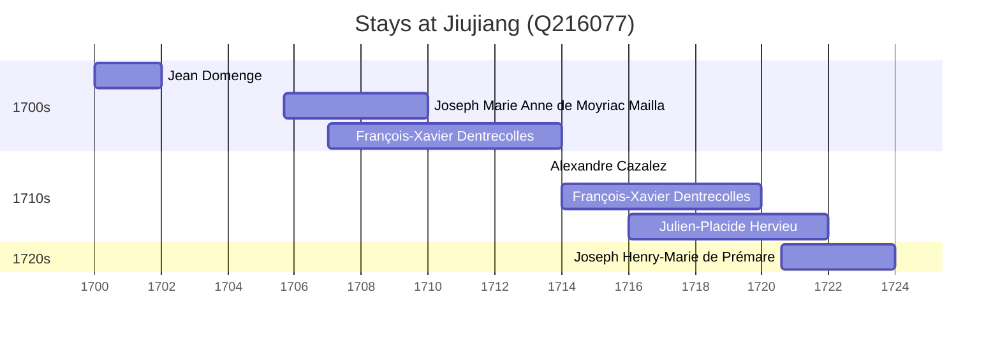

# Jiujiang (Q216077)

*prefecture-level city in Jiangxi, China*

Wikidata: [Q216077](https://www.wikidata.org/wiki/Q216077)

10 occurrence(s) across 7 transcribed value(s), 6 person(s).

**Transcribed variants:**

- `Kiukiang, Kiangsi` (1×, 1700–1700)
- `Kiukiang (Kieou-kiang, Kangsi)` (1×, 1705–1705)
- `Kiukiang` (4×, 1707–1721)
- `Kieou-kiam, Kangsi` (1×, 1709–1709)
- `Kieou Kiang, Kiang-si` (1×, 1713–1713)
- `Kiukiang (Kieou-kiang)` (1×, 1716–1716)
- `Kiukiang (Kieou-Kiang)` (1×, 1720–1720)

| Date | Variant | Person | Type | Entity id | Real entity |
|------|---------|--------|------|-----------|-------------|
| 1700 | Kiukiang, Kiangsi | Jean Domenge | estadia | [deh-jean-domenge](deh-jean-domenge) | — |
| 1705-09 | Kiukiang (Kieou-kiang, Kangsi) | Joseph Marie Anne de Moyriac Mailla | estadia | [deh-joseph-marie-anne-de-moyriac-mailla](deh-joseph-marie-anne-de-moyriac-mailla) | — |
| 1707 | Kiukiang | François-Xavier Dentrecolles | estadia | [deh-francois-xavier-dentrecolles](deh-francois-xavier-dentrecolles) | — |
| 1709 | Kiukiang | François-Xavier Dentrecolles | estadia | [deh-francois-xavier-dentrecolles](deh-francois-xavier-dentrecolles) | — |
| 1709-05-01 | Kieou-kiam, Kangsi | Joseph Marie Anne de Moyriac Mailla | jesuita-votos-local | [deh-joseph-marie-anne-de-moyriac-mailla](deh-joseph-marie-anne-de-moyriac-mailla) | — |
| 1713-06-18 | Kieou Kiang, Kiang-si | Alexandre Cazalez | jesuita-votos-local | [deh-alexandre-cazalez](deh-alexandre-cazalez) | — |
| 1714 | Kiukiang | François-Xavier Dentrecolles | estadia | [deh-francois-xavier-dentrecolles](deh-francois-xavier-dentrecolles) | — |
| 1716 | Kiukiang (Kieou-kiang) | Julien-Placide Hervieu | estadia | [deh-julien-placide-hervieu](deh-julien-placide-hervieu) | — |
| 1720-08 | Kiukiang (Kieou-Kiang) | Joseph Henry-Marie de Prémare | estadia | [deh-joseph-henry-marie-de-premare](deh-joseph-henry-marie-de-premare) | — |
| 1721 | Kiukiang | Julien-Placide Hervieu | estadia | [deh-julien-placide-hervieu](deh-julien-placide-hervieu) | — |

### Co-presence

These persons were plausibly at this place during overlapping periods (interval estimation from stay dates; rough — see method note below).

| Period | Persons |
|--------|---------|
| 1700s | [François-Xavier Dentrecolles](deh-francois-xavier-dentrecolles), [Joseph Marie Anne de Moyriac Mailla](deh-joseph-marie-anne-de-moyriac-mailla) |
| 1710s | [Alexandre Cazalez](deh-alexandre-cazalez), [François-Xavier Dentrecolles](deh-francois-xavier-dentrecolles), [Julien-Placide Hervieu](deh-julien-placide-hervieu) |
| 1720s | [Joseph Henry-Marie de Prémare](deh-joseph-henry-marie-de-premare), [Julien-Placide Hervieu](deh-julien-placide-hervieu) |

*4 overlapping pair(s) involving 5 person(s). Method: interval start = stay event date; end = next embarque/partida/different-place event, or death, or +15yr cap.*

