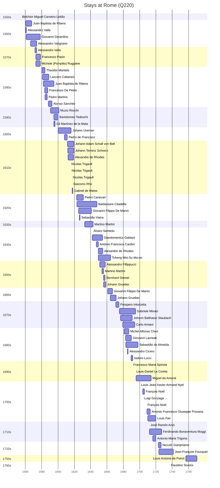

# Rome (Q220)

*capital and largest city of Italy*

Wikidata: [Q220](https://www.wikidata.org/wiki/Q220)

114 occurrence(s) across 5 transcribed value(s), 77 person(s).

**Transcribed variants:**

- `Roma` (109×, 1554–1782)
- `Roma (casa professa)` (2×, 1655–1694)
- `Roma (Casa del Giesu)` (1×, 1685–1685)
- `Roma (Congregação da Propaganda)` (1×, 1723–1723)
- `Goa` (1×, undated)

| Date | Variant | Person | Type | Entity id | Real entity |
|------|---------|--------|------|-----------|-------------|
| — | Roma | Claudio Filippo Grimaldi | estadia | [deh-claudio-filippo-grimaldi](deh-claudio-filippo-grimaldi) | — |
| — | Roma | Denis Li Thang | estadia | [deh-denis-li-thang](deh-denis-li-thang) | — |
| — | Roma | Diogo de Mesquita | estadia | [deh-diogo-de-mesquita](deh-diogo-de-mesquita) | — |
| — | Roma | Francisco Vieira | estadia | [deh-francisco-vieira](deh-francisco-vieira) | — |
| — | Roma | Louis Fan | estadia | [deh-louis-fan](deh-louis-fan) | — |
| — | Roma | Antonio Francesco Giuseppe Provana | estadia | [deh-louis-fan-ref1](deh-louis-fan-ref1) | [rp445313](rp445313) |
| — | Roma | Michael-Pierre Boym | estadia | [deh-michael-pierre-boym](deh-michael-pierre-boym) | — |
| 1554-06-24 | Roma | Belchior Miguel Carneiro Leitão | jesuita-votos-local | [deh-belchior-miguel-carneiro-leitao](deh-belchior-miguel-carneiro-leitao) | [rp973077](rp973077) |
| 1560-04-25 | Roma | Juan Baptista de Ribera | estadia | [deh-juan-baptista-de-ribera](deh-juan-baptista-de-ribera) | — |
| 1560-05-07 | Roma | Alessandro Valla | jesuita-entrada | [deh-alessandro-valla](deh-alessandro-valla) | — |
| 1561 | Roma | Giovanni Gerardino | jesuita-entrada | [deh-giovanni-gerardino](deh-giovanni-gerardino) | — |
| 1564-06-24 | Roma | Juan Baptista de Ribera | jesuita-votos-local | [deh-juan-baptista-de-ribera](deh-juan-baptista-de-ribera) | — |
| 1566-05-29 | Roma | Alessandro Valignano | jesuita-entrada | [deh-alessandro-valignano](deh-alessandro-valignano) | — |
| 1569-04-25 | Roma | Giovanni Gerardino | jesuita-votos-local | [deh-giovanni-gerardino](deh-giovanni-gerardino) | — |
| 1570-03-25 | Roma | Alessandro Valignano | jesuita-ordenacao-padre | [deh-alessandro-valignano](deh-alessandro-valignano) | — |
| 1571-08-16 | Roma | Matteo Ricci | jesuita-entrada | [deh-matteo-ricci](deh-matteo-ricci) | [rp302155](rp302155) |
| 1572 | Roma | Alessandro Valla | estadia | [deh-alessandro-valla](deh-alessandro-valla) | — |
| 1572-10-25 | Roma | Francesco Pasio | jesuita-entrada | [deh-francesco-pasio](deh-francesco-pasio) | — |
| 1572-10-28 | Roma | Michele (Pompilio) Ruggiere | jesuita-entrada | [deh-michele-ruggiere](deh-michele-ruggiere) | — |
| 1573-09-23 | Roma | Alessandro Valignano | partida | [deh-alessandro-valignano](deh-alessandro-valignano) | — |
| 1577-05-18 | Roma | Matteo Ricci | partida-x | [deh-matteo-ricci](deh-matteo-ricci) | [rp302155](rp302155) |
| 1580-03-17 | Roma | Theodor Mantels | jesuita-entrada | [deh-theodor-mantels](deh-theodor-mantels) | — |
| 1581-02-27 | Roma | Lazzaro Cattaneo | jesuita-entrada | [deh-lazzaro-cattaneo](deh-lazzaro-cattaneo) | — |
| 1582 | Roma | Juan Baptista de Ribera | estadia | [deh-juan-baptista-de-ribera](deh-juan-baptista-de-ribera) | — |
| 1583-08-15 | Roma | Francesco De Petris | jesuita-entrada | [deh-francesco-de-petris](deh-francesco-de-petris) | — |
| 1584 | Roma | Pedro Martins | estadia | [deh-pedro-martins](deh-pedro-martins) | — |
| 1588-03 | Roma | Alonso Sanchéz | estadia | [deh-alonso-sanchez](deh-alonso-sanchez) | — |
| 1588-11 | Roma | Michele (Pompilio) Ruggiere | partida | [deh-michele-ruggiere](deh-michele-ruggiere) | — |
| 1589-08-15 | Roma | Alonso Sanchéz | jesuita-votos-local | [deh-alonso-sanchez](deh-alonso-sanchez) | — |
| 1590-11-08 | Roma | Muzio Rocchi | jesuita-entrada | [deh-muzio-rocchi](deh-muzio-rocchi) | — |
| 1592-10-09 | Roma | Gil Martínez de la Mata | partida | [deh-gil-martinez-de-la-mata](deh-gil-martinez-de-la-mata) | — |
| 1594-11-06 | Roma | Bartolomeo Tedeschi | jesuita-entrada | [deh-bartolomeo-tedeschi](deh-bartolomeo-tedeschi) | [rp086162](rp086162) |
| 1595 | Roma | Gil Martínez de la Mata | estadia | [deh-gil-martinez-de-la-mata](deh-gil-martinez-de-la-mata) | — |
| 1600-01-01 | Roma | Johann Ureman | jesuita-entrada | [deh-johann-ureman](deh-johann-ureman) | — |
| 1608 | Roma | Pedro de Francisco | estadia | [deh-pedro-de-francisco](deh-pedro-de-francisco) | — |
| 1611-10-21 | Roma | Johann Adam Schall von Bell | jesuita-entrada | [deh-johann-adam-schall-von-bell](deh-johann-adam-schall-von-bell) | — |
| 1611-11-01 | Roma | Johann Terrenz Schreck | jesuita-entrada | [deh-johann-terrenz-schreck](deh-johann-terrenz-schreck) | — |
| 1612-04-14 | Roma | Alexandre de Rhodes | jesuita-entrada | [deh-alexandre-de-rhodes](deh-alexandre-de-rhodes) | — |
| 1613-02-09 | Roma | Nicolas Trigault | partida | [deh-nicolas-trigault](deh-nicolas-trigault) | — |
| 1614-10 | Roma | Gabriel de Matos | partida | [deh-gabriel-de-matos](deh-gabriel-de-matos) | — |
| 1614-10-11 | Roma | Nicolas Trigault | chegada | [deh-nicolas-trigault](deh-nicolas-trigault) | — |
| 1615-01-01 | Roma | Nicolas Trigault | jesuita-votos-local | [deh-nicolas-trigault](deh-nicolas-trigault) | — |
| 1616-05 | Roma | Nicolas Trigault | estadia | [deh-nicolas-trigault](deh-nicolas-trigault) | — |
| 1617 | Roma | Giacomo Rho | jesuita-ordenacao-padre | [deh-giacomo-rho](deh-giacomo-rho) | — |
| 1617-05 | Roma | Gabriel de Matos | estadia | [deh-gabriel-de-matos](deh-gabriel-de-matos) | — |
| 1622-10-03 | Roma | Pietro Canevari | jesuita-entrada | [deh-pietro-canevari](deh-pietro-canevari) | — |
| 1623-02-06 | Roma | Baldassare Citadella | jesuita-entrada | [deh-baldassare-citadella](deh-baldassare-citadella) | — |
| 1625-02-18 | Roma | Giovanni Filippo De Marini | jesuita-entrada | [deh-giovanni-filippo-de-marini](deh-giovanni-filippo-de-marini) | — |
| 1626-05 | Roma | Sebastião Vieira | estadia | [deh-sebastiao-vieira](deh-sebastiao-vieira) | — |
| 1632-10-08 | Roma | Martino Martini | jesuita-entrada | [deh-martino-martini](deh-martino-martini) | — |
| 1636 | Roma | Álvaro Semedo | partida | [deh-alvaro-semedo](deh-alvaro-semedo) | — |
| 1642 | Roma | Álvaro Semedo | estadia | [deh-alvaro-semedo](deh-alvaro-semedo) | — |
| 1642 | Roma | Giandomenico Gabiani | estadia | [deh-giandomenico-gabiani](deh-giandomenico-gabiani) | [rp565060](rp565060) |
| 1645-12-20 | Roma | Alexandre de Rhodes | partida | [deh-alexandre-de-rhodes](deh-alexandre-de-rhodes) | — |
| 1645-12-20 | Roma | Tcheng Wei-Su Ma-no | partida | [deh-alexandre-de-rhodes-ref1](deh-alexandre-de-rhodes-ref1) | [rp166098](rp166098) |
| 1647 | Roma | António Francisco Cardim | estadia | [deh-antonio-francisco-cardim](deh-antonio-francisco-cardim) | [rp536947](rp536947) |
| 1649-06-27 | Roma | Alexandre de Rhodes | chegada | [deh-alexandre-de-rhodes](deh-alexandre-de-rhodes) | — |
| 1649-06-27 | Roma | Tcheng Wei-Su Ma-no | estadia | [deh-alexandre-de-rhodes-ref1](deh-alexandre-de-rhodes-ref1) | [rp166098](rp166098) |
| 1650 | Roma | Martino Martini | partida | [deh-martino-martini](deh-martino-martini) | — |
| 1651-01-26 | Roma | Alessandro Fillippucci | jesuita-entrada | [deh-alessandro-fillippucci](deh-alessandro-fillippucci) | — |
| 1651-10-17 | Roma | Manuel de Siqueira Tcheng | jesuita-entrada | [deh-manuel-de-siqueira-tcheng](deh-manuel-de-siqueira-tcheng) | [rp166098](rp166098) |
| 1654 | Roma | Martino Martini | estadia | [deh-martino-martini](deh-martino-martini) | — |
| 1655-08-15 | Roma (casa professa) | Martino Martini | jesuita-votos-local | [deh-martino-martini](deh-martino-martini) | — |
| 1656 | Roma | Johann Grueber | estadia | [deh-johann-grueber](deh-johann-grueber) | — |
| 1656 | Roma | Bernhard Diestel | estadia | [deh-bernhard-diestel](deh-bernhard-diestel) | — |
| 1661 | Roma | Giovanni Filippo De Marini | estadia | [deh-giovanni-filippo-de-marini](deh-giovanni-filippo-de-marini) | — |
| 1661-04-13 | Roma | Johann Grueber | partida | [deh-johann-grueber](deh-johann-grueber) | — |
| 1664-02-20 | Roma | Johann Grueber | estadia | [deh-johann-grueber](deh-johann-grueber) | — |
| 1669-01-21 | Roma | Prospero Intorcetta | partida | [deh-prospero-intorcetta](deh-prospero-intorcetta) | — |
| 1671 | Roma | Prospero Intorcetta | estadia | [deh-prospero-intorcetta](deh-prospero-intorcetta) | — |
| 1673 | Roma | Baltasar Diego da Rocha | partida | [deh-baltasar-diego-da-rocha](deh-baltasar-diego-da-rocha) | — |
| 1675-04-13 | Roma | Gabriele Minaci | jesuita-entrada | [deh-gabriele-minaci](deh-gabriele-minaci) | — |
| 1676-08-26 | Roma | Johann Balthasar Staubach | jesuita-entrada | [deh-johann-balthasar-staubach](deh-johann-balthasar-staubach) | — |
| 1679-05-12 | Roma | Carlo Amiani | jesuita-entrada | [deh-carlo-amiani](deh-carlo-amiani) | — |
| 1681-12-05 | Roma | Philippe Couplet | partida | [deh-philippe-couplet](deh-philippe-couplet) | [rp551005](rp551005) |
| 1682-11-20 | Roma | Giovanni Laureati | jesuita-entrada | [deh-giovanni-laureati](deh-giovanni-laureati) | [rp323905](rp323905) |
| 1685-08-15 | Roma (Casa del Giesu) | Gabriele Minaci | jesuita-votos-local | [deh-gabriele-minaci](deh-gabriele-minaci) | — |
| 1689-09-07 | Roma | Isidoro Lucci | jesuita-entrada | [deh-isidoro-lucci](deh-isidoro-lucci) | — |
| 1690-08-15 | Roma | Francesco Maria Spinola | jesuita-votos-local | [deh-francesco-maria-spinola](deh-francesco-maria-spinola) | [rp574322](rp574322) |
| 1694-03-25 | Roma (casa professa) | Louis-Daniel Le Comte | jesuita-votos-local | [deh-louis-daniel-le-comte](deh-louis-daniel-le-comte) | — |
| 1695-08 | Roma | Miguel do Amaral | estadia | [deh-miguel-do-amaral](deh-miguel-do-amaral) | [rp086368](rp086368) |
| 1700 | Roma | Louis Jean-Xavier Armand Nyel | jesuita-ordenacao-padre | [deh-louis-jean-xavier-armand-nyel](deh-louis-jean-xavier-armand-nyel) | — |
| 1701-12-06 | Roma | François Noël | partida | [deh-francois-noel](deh-francois-noel) | — |
| 1702 | Roma | Diogo Vidal | partida | [deh-diogo-vidal](deh-diogo-vidal) | — |
| 1702-01-14 | Roma | Kaspar Castner | partida | [deh-kaspar-castner](deh-kaspar-castner) | — |
| 1703-12-30 | Roma | François Noël | estadia | [deh-francois-noel](deh-francois-noel) | — |
| 1704 | Roma | Luigi Gonzaga | jesuita-ordenacao-padre | [deh-luigi-gonzaga](deh-luigi-gonzaga) | — |
| 1706 | Roma | Luís de França | partida | [deh-luis-de-franca](deh-luis-de-franca) | — |
| 1706-10-17 | Roma | Antoine de Beauvollier | partida | [deh-antoine-de-beauvollier](deh-antoine-de-beauvollier) | — |
| 1706-10-17 | Roma | António de Barros | partida | [deh-antonio-de-barros](deh-antonio-de-barros) | — |
| 1708 | Roma | François Noël | estadia | [deh-francois-noel](deh-francois-noel) | — |
| 1708-01-14 | Roma | Antonio Francesco Giuseppe Provana | partida | [deh-antonio-francesco-giuseppe-provana](deh-antonio-francesco-giuseppe-provana) | [rp445313](rp445313) |
| 1708-01-14 | Roma | José Ramón Arxó | partida | [deh-jose-ramon-arxo](deh-jose-ramon-arxo) | — |
| 1709 | Roma | Antonio Francesco Giuseppe Provana | chegada | [deh-antonio-francesco-giuseppe-provana](deh-antonio-francesco-giuseppe-provana) | [rp445313](rp445313) |
| 1709-12-15 | Roma | Louis Fan | jesuita-entrada | [deh-louis-fan](deh-louis-fan) | — |
| 1711-12-13 | Roma | Ferdinando Bonaventura Moggi | jesuita-entrada | [deh-ferdinando-bonaventura-moggi](deh-ferdinando-bonaventura-moggi) | — |
| 1712-02-05 | Roma | João Mourão | partida | [deh-joao-mourao](deh-joao-mourao) | — |
| 1715 | Roma | Louis Jean-Xavier Armand Nyel | partida | [deh-louis-jean-xavier-armand-nyel](deh-louis-jean-xavier-armand-nyel) | — |
| 1716 | Roma | Antonio-Maria Trigona | estadia | [deh-antonio-maria-trigona](deh-antonio-maria-trigona) | — |
| 1719-11-21 | Roma | Kilian Stumpf | partida | [deh-kilian-stumpf](deh-kilian-stumpf) | — |
| 1721-03-13 | Roma | Niccolò Gianpriamo | partida | [deh-niccolo-gianpriamo](deh-niccolo-gianpriamo) | — |
| 1722-10-19 | Roma | Niccolò Gianpriamo | chegada | [deh-niccolo-gianpriamo](deh-niccolo-gianpriamo) | — |
| 1723-06-08 | Roma (Congregação da Propaganda) | Jean-François Foucquet | estadia | [deh-jean-francois-foucquet](deh-jean-francois-foucquet) | — |
| 1725-03-25 | Roma | Jean-François Foucquet | estadia | [deh-jean-francois-foucquet](deh-jean-francois-foucquet) | — |
| 1741-03-14 | Roma | Jean-François Foucquet | morte | [deh-jean-francois-foucquet](deh-jean-francois-foucquet) | — |
| 1756-07-09 | Roma | Louis Antoine de Poirot | jesuita-entrada | [deh-louis-antoine-de-poirot](deh-louis-antoine-de-poirot) | — |
| 1765 | Roma | Louis Antoine de Poirot | jesuita-ordenacao-padre | [deh-louis-antoine-de-poirot](deh-louis-antoine-de-poirot) | — |
| 1766 | Roma | Louis Antoine de Poirot | jesuita-ordenacao-padre | [deh-louis-antoine-de-poirot](deh-louis-antoine-de-poirot) | — |
| 1767-08-10 | Roma | Faustino Soares | jesuita-votos-local | [deh-faustino-soares](deh-faustino-soares) | — |
| 1782 | Roma | José Rosado | morte | [deh-jose-rosado](deh-jose-rosado) | — |
| >1665-04-20:<1668-04-22 | Roma | Sebastião de Almeida | estadia | [deh-sebastiao-de-almeida](deh-sebastiao-de-almeida) | — |
| >1681:<1687 | Roma | Michel Alfonso Chen | estadia | [deh-michel-alfonso-chen](deh-michel-alfonso-chen) | — |
| >1685 | Goa | Alessandro Cicero | estadia | [deh-alessandro-cicero](deh-alessandro-cicero) | [rp532453](rp532453) |
| >1708-01-14:<1711-07-29 | Roma | José Ramón Arxó | estadia | [deh-jose-ramon-arxo](deh-jose-ramon-arxo) | — |

### Co-presence

These persons were plausibly at this place during overlapping periods (interval estimation from stay dates; rough — see method note below).

| Period | Persons |
|--------|---------|
| 1560s | [Alessandro Valignano](deh-alessandro-valignano), [Alessandro Valla](deh-alessandro-valla), [Giovanni Gerardino](deh-giovanni-gerardino), [Juan Baptista de Ribera](deh-juan-baptista-de-ribera) |
| 1570s | [Alessandro Valignano](deh-alessandro-valignano), [Alessandro Valla](deh-alessandro-valla), [Francesco Pasio](deh-francesco-pasio), [Giovanni Gerardino](deh-giovanni-gerardino), [Michele (Pompilio) Ruggiere](deh-michele-ruggiere) |
| 1580s | [Alonso Sanchéz](deh-alonso-sanchez), [Francesco De Petris](deh-francesco-de-petris), [Juan Baptista de Ribera](deh-juan-baptista-de-ribera), [Lazzaro Cattaneo](deh-lazzaro-cattaneo), [Pedro Martins](deh-pedro-martins), [Theodor Mantels](deh-theodor-mantels) |
| 1590s | [Alonso Sanchéz](deh-alonso-sanchez), [Bartolomeo Tedeschi](rp086162), [Gil Martínez de la Mata](deh-gil-martinez-de-la-mata), [Juan Baptista de Ribera](deh-juan-baptista-de-ribera), [Muzio Rocchi](deh-muzio-rocchi) |
| 1600s | [Johann Ureman](deh-johann-ureman), [Muzio Rocchi](deh-muzio-rocchi), [Pedro de Francisco](deh-pedro-de-francisco) |
| 1610s | [Alexandre de Rhodes](deh-alexandre-de-rhodes), [Gabriel de Matos](deh-gabriel-de-matos), [Giacomo Rho](deh-giacomo-rho), [Johann Adam Schall von Bell](deh-johann-adam-schall-von-bell), [Johann Terrenz Schreck](deh-johann-terrenz-schreck), [Johann Ureman](deh-johann-ureman), [Nicolas Trigault](deh-nicolas-trigault) |
| 1620s | [Baldassare Citadella](deh-baldassare-citadella), [Giovanni Filippo De Marini](deh-giovanni-filippo-de-marini), [Pietro Canevari](deh-pietro-canevari), [Sebastião Vieira](deh-sebastiao-vieira) |
| 1630s | [Baldassare Citadella](deh-baldassare-citadella), [Giovanni Filippo De Marini](deh-giovanni-filippo-de-marini), [Martino Martini](deh-martino-martini) |
| 1640s | [Alexandre de Rhodes](deh-alexandre-de-rhodes), [António Francisco Cardim](rp536947), [Baldassare Citadella](deh-baldassare-citadella), [Giandomenico Gabiani](rp565060), [Martino Martini](deh-martino-martini), [Álvaro Semedo](deh-alvaro-semedo) |
| 1650s | [Alessandro Fillippucci](deh-alessandro-fillippucci), [Alexandre de Rhodes](deh-alexandre-de-rhodes), [Bernhard Diestel](deh-bernhard-diestel), [Giandomenico Gabiani](rp565060), [Johann Grueber](deh-johann-grueber), [Martino Martini](deh-martino-martini) |
| 1660s | [Giovanni Filippo De Marini](deh-giovanni-filippo-de-marini), [Johann Grueber](deh-johann-grueber) |
| 1670s | [Carlo Amiani](deh-carlo-amiani), [Gabriele Minaci](deh-gabriele-minaci), [Johann Balthasar Staubach](deh-johann-balthasar-staubach), [Johann Grueber](deh-johann-grueber), [Prospero Intorcetta](deh-prospero-intorcetta) |
| 1680s | [Alessandro Cicero](rp532453), [Carlo Amiani](deh-carlo-amiani), [Gabriele Minaci](deh-gabriele-minaci), [Giovanni Laureati](rp323905), [Isidoro Lucci](deh-isidoro-lucci), [Johann Balthasar Staubach](deh-johann-balthasar-staubach), [Michel Alfonso Chen](deh-michel-alfonso-chen) |
| 1690s | [Carlo Amiani](deh-carlo-amiani), [Francesco Maria Spinola](rp574322), [Gabriele Minaci](deh-gabriele-minaci), [Isidoro Lucci](deh-isidoro-lucci), [Johann Balthasar Staubach](deh-johann-balthasar-staubach), [Louis-Daniel Le Comte](deh-louis-daniel-le-comte) |
| 1700s | [Antonio Francesco Giuseppe Provana](rp445313), [François Noël](deh-francois-noel), [Louis Fan](deh-louis-fan), [Louis Jean-Xavier Armand Nyel](deh-louis-jean-xavier-armand-nyel), [Luigi Gonzaga](deh-luigi-gonzaga), [Miguel do Amaral](rp086368) |
| 1710s | [Antonio Francesco Giuseppe Provana](rp445313), [Antonio-Maria Trigona](deh-antonio-maria-trigona), [Ferdinando Bonaventura Moggi](deh-ferdinando-bonaventura-moggi), [José Ramón Arxó](deh-jose-ramon-arxo), [Louis Fan](deh-louis-fan), [Miguel do Amaral](rp086368) |
| 1720s | [Ferdinando Bonaventura Moggi](deh-ferdinando-bonaventura-moggi), [Jean-François Foucquet](deh-jean-francois-foucquet), [Niccolò Gianpriamo](deh-niccolo-gianpriamo) |
| 1760s | [Faustino Soares](deh-faustino-soares), [Louis Antoine de Poirot](deh-louis-antoine-de-poirot) |

*127 overlapping pair(s) involving 56 person(s). Method: interval start = stay event date; end = next embarque/partida/different-place event, or death, or +15yr cap.*

