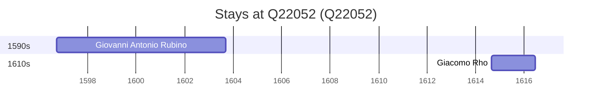

# Q22052

*(fetch error: HTTP Error 429: Too Many Requests)*

Wikidata: [Q22052](https://www.wikidata.org/wiki/Q22052)

2 occurrence(s) across 1 transcribed value(s), 2 person(s).

**Transcribed variants:**

- `Arona` (2×, 1596–1614)

| Date | Variant | Person | Type | Entity id | Real entity |
|------|---------|--------|------|-----------|-------------|
| 1596-09-21 | Arona | Giovanni Antonio Rubino | jesuita-entrada | [deh-giovanni-antonio-rubino](deh-giovanni-antonio-rubino) | — |
| 1614-08-24 | Arona | Giacomo Rho | jesuita-entrada | [deh-giacomo-rho](deh-giacomo-rho) | — |

