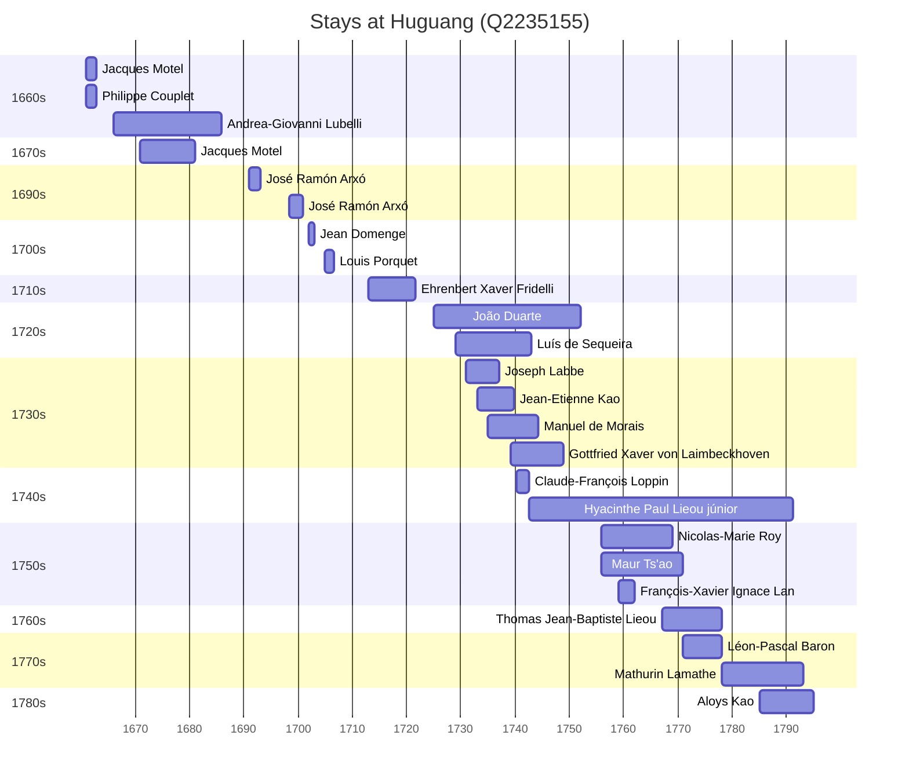

# Huguang (Q2235155)

*Province of the Qing Empire, eventually divided into Hubei and Hunan*

Wikidata: [Q2235155](https://www.wikidata.org/wiki/Q2235155)

38 occurrence(s) across 8 transcribed value(s), 29 person(s).

**Transcribed variants:**

- `Hukwang` (26×, 1661–1788)
- `Hou-kouang` (6×, 1671–1769)
- `Hukwang, Inchow (Kin-tcheou)` (1×, 1733–1733)
- `Hou-Kouang` (1×, 1735–1735)
- `Hukwang (montanhas)` (1×, 1740–1740)
- `Hou quang` (1×, 1760–1760)
- `Hukwang (monte Mou-pouan chan, no oratório de André Yuen)` (1×, undated)
- `Hukwwang` (1×, undated)

| Date | Variant | Person | Type | Entity id | Real entity |
|------|---------|--------|------|-----------|-------------|
| — | Hukwang (monte Mou-pouan chan, no oratório de André Yuen) | Claude-François Loppin | jesuita-votos-local | [deh-claude-francois-loppin](deh-claude-francois-loppin) | — |
| — | Hukwang | Germain Macret | estadia | [deh-germain-macret](deh-germain-macret) | — |
| — | Hukwang | Jean Baborier | estadia | [deh-jean-baborier](deh-jean-baborier) | — |
| — | Hou-kouang | Jean Noëllas | estadia | [deh-jean-noellas](deh-jean-noellas) | — |
| — | Hukwang | Jean-Régis-Lieou | estadia | [deh-jean-regis-lieou](deh-jean-regis-lieou) | [rp660632](rp660632) |
| — | Hou-kouang | José Monteiro | estadia | [deh-jose-monteiro](deh-jose-monteiro) | — |
| — | Hukwang | Rui de Figueiredo | estadia | [deh-rui-de-figueiredo](deh-rui-de-figueiredo) | — |
| 1661 | Hukwang | Jacques Motel | estadia | [deh-jacques-motel](deh-jacques-motel) | — |
| 1671 | Hou-kouang | Jacques Motel | estadia | [deh-jacques-motel](deh-jacques-motel) | — |
| 1691 | Hukwang | José Ramón Arxó | estadia | [deh-jose-ramon-arxo](deh-jose-ramon-arxo) | — |
| 1698-04-29 | Hukwang | José Ramón Arxó | estadia | [deh-jose-ramon-arxo](deh-jose-ramon-arxo) | — |
| 1702 | Hukwang | Jean Domenge | estadia | [deh-jean-domenge](deh-jean-domenge) | — |
| 1705 | Hukwang | Louis Porquet | estadia | [deh-louis-porquet](deh-louis-porquet) | [rp585015](rp585015) |
| 1713 | Hukwang | Ehrenbert Xaver Fridelli | estadia | [deh-ehrenbert-xaver-fridelli](deh-ehrenbert-xaver-fridelli) | — |
| 1725 | Hukwang | João Duarte | estadia | [deh-joao-duarte](deh-joao-duarte) | — |
| 1729 | Hou-kouang | Luís de Sequeira | estadia | [deh-luis-de-sequeira](deh-luis-de-sequeira) | — |
| 1731 | Hukwang | Joseph Labbe | estadia | [deh-joseph-labbe](deh-joseph-labbe) | — |
| 1733 | Hukwang, Inchow (Kin-tcheou) | Jean-Etienne Kao | estadia | [deh-jean-etienne-kao](deh-jean-etienne-kao) | — |
| 1735 | Hou-Kouang | Manuel de Morais | chegada | [deh-manuel-de-morais](deh-manuel-de-morais) | — |
| 1739-03 | Hukwang | Gottfried Xaver von Laimbeckhoven | estadia | [deh-gottfried-xaver-von-laimbeckhoven](deh-gottfried-xaver-von-laimbeckhoven) | — |
| 1740 | Hukwang | João Duarte | estadia | [deh-joao-duarte](deh-joao-duarte) | — |
| 1740-03-15 | Hukwang (montanhas) | Claude-François Loppin | estadia | [deh-claude-francois-loppin](deh-claude-francois-loppin) | — |
| 1742-08-07 | Hukwang | Hyacinthe Paul Lieou, júnior | nascimento | [deh-hyacinthe-paul-lieou-junior](deh-hyacinthe-paul-lieou-junior) | — |
| 1755-11 | Hou-kouang | Nicolas-Marie Roy | estadia | [deh-nicolas-marie-roy](deh-nicolas-marie-roy) | — |
| 1756 | Hukwang | Maur Ts'ao | estadia | [deh-maur-tsao](deh-maur-tsao) | — |
| 1759 | Hukwang | François-Xavier Ignace Lan | estadia | [deh-francois-xavier-ignace-lan](deh-francois-xavier-ignace-lan) | — |
| 1760-04-30 | Hou quang | François-Xavier Ignace Lan | jesuita-votos-local | [deh-francois-xavier-ignace-lan](deh-francois-xavier-ignace-lan) | — |
| 1767 | Hukwang | Thomas Jean-Baptiste Lieou | estadia | [deh-thomas-jean-baptiste-lieou](deh-thomas-jean-baptiste-lieou) | — |
| 1769-01-08 | Hou-kouang | Nicolas-Marie Roy | morte | [deh-nicolas-marie-roy](deh-nicolas-marie-roy) | — |
| 1771 | Hukwang | Léon-Pascal Baron | estadia | [deh-leon-pascal-baron](deh-leon-pascal-baron) | — |
| 1778 | Hukwang | Mathurin Lamathe | estadia | [deh-mathurin-lamathe](deh-mathurin-lamathe) | — |
| 1784 | Hukwang | Hyacinthe Paul Lieou, júnior | estadia | [deh-hyacinthe-paul-lieou-junior](deh-hyacinthe-paul-lieou-junior) | — |
| 1784-08 | Hukwang | Mathurin Lamathe | estadia | [deh-mathurin-lamathe](deh-mathurin-lamathe) | — |
| 1785 | Hukwang | Aloys Kao | estadia | [deh-aloys-kao](deh-aloys-kao) | — |
| 1785-11 | Hukwang | Mathurin Lamathe | estadia | [deh-mathurin-lamathe](deh-mathurin-lamathe) | — |
| 1788 | Hukwang | Agostinho de Avellar | morte | [deh-agostinho-de-avellar](deh-agostinho-de-avellar) | — |
| >1661 | Hukwwang | Philippe Couplet | estadia | [deh-philippe-couplet](deh-philippe-couplet) | [rp551005](rp551005) |
| >1666:<1685 | Hukwang | Andrea-Giovanni Lubelli | estadia | [deh-andrea-giovanni-lubelli](deh-andrea-giovanni-lubelli) | — |

### Co-presence

These persons were plausibly at this place during overlapping periods (interval estimation from stay dates; rough — see method note below).

| Period | Persons |
|--------|---------|
| 1660s | [Jacques Motel](deh-jacques-motel), [Philippe Couplet](rp551005) |
| 1670s | [Andrea-Giovanni Lubelli](deh-andrea-giovanni-lubelli), [Jacques Motel](deh-jacques-motel) |
| 1720s | [João Duarte](deh-joao-duarte), [Luís de Sequeira](deh-luis-de-sequeira) |
| 1730s | [Gottfried Xaver von Laimbeckhoven](deh-gottfried-xaver-von-laimbeckhoven), [Jean-Etienne Kao](deh-jean-etienne-kao), [Joseph Labbe](deh-joseph-labbe), [João Duarte](deh-joao-duarte), [Luís de Sequeira](deh-luis-de-sequeira), [Manuel de Morais](deh-manuel-de-morais) |
| 1740s | [Claude-François Loppin](deh-claude-francois-loppin), [Gottfried Xaver von Laimbeckhoven](deh-gottfried-xaver-von-laimbeckhoven), [Hyacinthe Paul Lieou, júnior](deh-hyacinthe-paul-lieou-junior), [João Duarte](deh-joao-duarte), [Luís de Sequeira](deh-luis-de-sequeira), [Manuel de Morais](deh-manuel-de-morais) |
| 1750s | [François-Xavier Ignace Lan](deh-francois-xavier-ignace-lan), [Hyacinthe Paul Lieou, júnior](deh-hyacinthe-paul-lieou-junior), [Nicolas-Marie Roy](deh-nicolas-marie-roy) |
| 1760s | [Hyacinthe Paul Lieou, júnior](deh-hyacinthe-paul-lieou-junior), [Nicolas-Marie Roy](deh-nicolas-marie-roy), [Thomas Jean-Baptiste Lieou](deh-thomas-jean-baptiste-lieou) |
| 1770s | [Hyacinthe Paul Lieou, júnior](deh-hyacinthe-paul-lieou-junior), [Léon-Pascal Baron](deh-leon-pascal-baron), [Thomas Jean-Baptiste Lieou](deh-thomas-jean-baptiste-lieou) |
| 1780s | [Aloys Kao](deh-aloys-kao), [Hyacinthe Paul Lieou, júnior](deh-hyacinthe-paul-lieou-junior) |

*33 overlapping pair(s) involving 16 person(s). Method: interval start = stay event date; end = next embarque/partida/different-place event, or death, or +15yr cap.*

