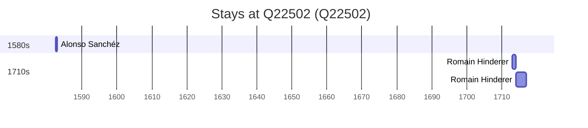

# Q22502

*(fetch error: HTTP Error 429: Too Many Requests)*

Wikidata: [Q22502](https://www.wikidata.org/wiki/Q22502)

4 occurrence(s) across 3 transcribed value(s), 3 person(s).

**Transcribed variants:**

- `[No mar, perto do Taiwan]` (1×, 1698–1698)
- `Formosa` (2×, 1713–1714)
- `Ilha Formosa` (1×, undated)

| Date | Variant | Person | Type | Entity id | Real entity |
|------|---------|--------|------|-----------|-------------|
| 1698-08-18 | [No mar, perto do Taiwan] | Philippe Avril | morte | [deh-philippe-avril](deh-philippe-avril) | [rp636254](rp636254) |
| 1713 | Formosa | Romain Hinderer | estadia | [deh-romain-hinderer](deh-romain-hinderer) | — |
| 1714 | Formosa | Romain Hinderer | estadia | [deh-romain-hinderer](deh-romain-hinderer) | — |
| >1582-07-06 | Ilha Formosa | Alonso Sanchéz | estadia | [deh-alonso-sanchez](deh-alonso-sanchez) | — |

