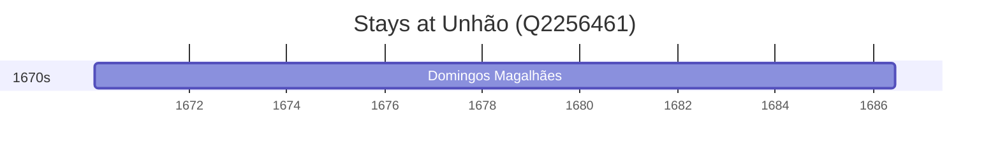

# Unhão (Q2256461)

*former civil parish in Portugal*

Wikidata: [Q2256461](https://www.wikidata.org/wiki/Q2256461)

1 occurrence(s) across 1 transcribed value(s), 1 person(s).

**Transcribed variants:**

- `Unhão, diocese de Braga` (1×, 1670–1670)

| Date | Variant | Person | Type | Entity id | Real entity |
|------|---------|--------|------|-----------|-------------|
| 1670-01-25 | Unhão, diocese de Braga | Domingos Magalhães | nascimento | [deh-domingos-magalhaes](deh-domingos-magalhaes) | — |

