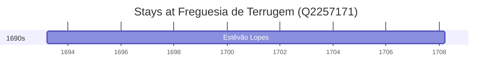

# Freguesia de Terrugem (Q2257171)

*civil parish in Elvas, Portugal*

Wikidata: [Q2257171](https://www.wikidata.org/wiki/Q2257171)

1 occurrence(s) across 1 transcribed value(s), 1 person(s).

**Transcribed variants:**

- `Santo António da Terrugem, diocese de Elvas` (1×, 1693–1693)

| Date | Variant | Person | Type | Entity id | Real entity |
|------|---------|--------|------|-----------|-------------|
| 1693-03-21 | Santo António da Terrugem, diocese de Elvas | Estêvão Lopes | nascimento | [deh-estevao-lopes](deh-estevao-lopes) | — |

