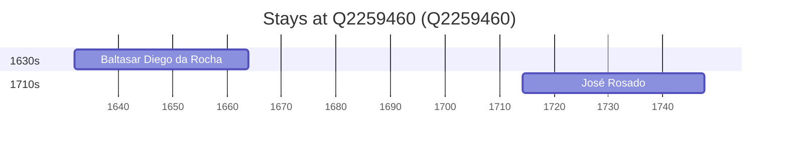

# Q2259460

*(fetch error: HTTP Error 429: Too Many Requests)*

Wikidata: [Q2259460](https://www.wikidata.org/wiki/Q2259460)

3 occurrence(s) across 1 transcribed value(s), 3 person(s).

**Transcribed variants:**

- `Vimieiro, diocese de Évora` (3×, 1632–1714)

| Date | Variant | Person | Type | Entity id | Real entity |
|------|---------|--------|------|-----------|-------------|
| — | Vimieiro, diocese de Évora | Domingos de Brito | nascimento | [deh-domingos-de-brito](deh-domingos-de-brito) | — |
| 1632 | Vimieiro, diocese de Évora | Baltasar Diego da Rocha | nascimento | [deh-baltasar-diego-da-rocha](deh-baltasar-diego-da-rocha) | — |
| 1714-03-26 | Vimieiro, diocese de Évora | José Rosado | nascimento | [deh-jose-rosado](deh-jose-rosado) | — |

