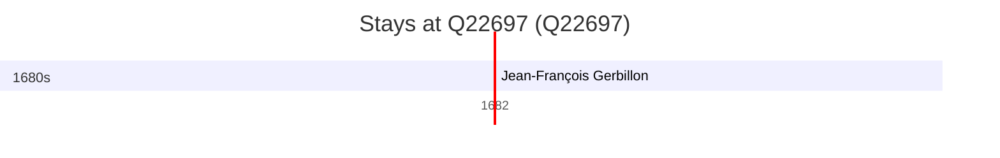

# Q22697

*(fetch error: HTTP Error 429: Too Many Requests)*

Wikidata: [Q22697](https://www.wikidata.org/wiki/Q22697)

1 occurrence(s) across 1 transcribed value(s), 1 person(s).

**Transcribed variants:**

- `Molsheim` (1×, 1682–1682)

| Date | Variant | Person | Type | Entity id | Real entity |
|------|---------|--------|------|-----------|-------------|
| 1682-12-16 | Molsheim | Jean-François Gerbillon | jesuita-ordenacao-padre | [deh-jean-francois-gerbillon](deh-jean-francois-gerbillon) | — |

