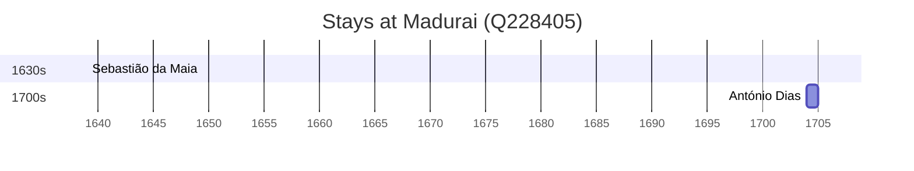

# Madurai (Q228405)

*city of Tamil Nadu in southern India*

Wikidata: [Q228405](https://www.wikidata.org/wiki/Q228405)

3 occurrence(s) across 1 transcribed value(s), 3 person(s).

**Transcribed variants:**

- `Madurai` (3×, 1639–1704)

| Date | Variant | Person | Type | Entity id | Real entity |
|------|---------|--------|------|-----------|-------------|
| — | Madurai | Manuel Rodrigues | estadia | [deh-manuel-rodrigues-ii-ref2](deh-manuel-rodrigues-ii-ref2) | — |
| 1639 | Madurai | Sebastião da Maia | estadia | [deh-sebastiao-da-maia](deh-sebastiao-da-maia) | — |
| 1704 | Madurai | António Dias | estadia | [deh-antonio-dias](deh-antonio-dias) | — |

