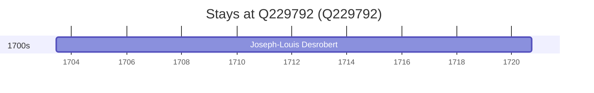

# Q229792

*(fetch error: HTTP Error 429: Too Many Requests)*

Wikidata: [Q229792](https://www.wikidata.org/wiki/Q229792)

1 occurrence(s) across 1 transcribed value(s), 1 person(s).

**Transcribed variants:**

- `Montmédy` (1×, 1703–1703)

| Date | Variant | Person | Type | Entity id | Real entity |
|------|---------|--------|------|-----------|-------------|
| 1703-06-12 | Montmédy | Joseph-Louis Desrobert | nascimento | [deh-joseph-louis-desrobert](deh-joseph-louis-desrobert) | — |

