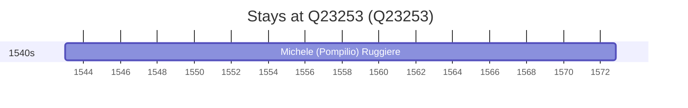

# Q23253

*(fetch error: HTTP Error 429: Too Many Requests)*

Wikidata: [Q23253](https://www.wikidata.org/wiki/Q23253)

1 occurrence(s) across 1 transcribed value(s), 1 person(s).

**Transcribed variants:**

- `Spinazzola, Bari` (1×, 1543–1543)

| Date | Variant | Person | Type | Entity id | Real entity |
|------|---------|--------|------|-----------|-------------|
| 1543 | Spinazzola, Bari | Michele (Pompilio) Ruggiere | nascimento | [deh-michele-ruggiere](deh-michele-ruggiere) | — |

