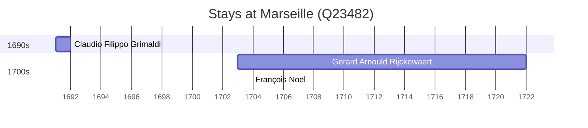

# Marseille (Q23482)

*French commune in Bouches-du-Rhône, Provence-Alpes-Côte d'Azur; the second largest city of France*

Wikidata: [Q23482](https://www.wikidata.org/wiki/Q23482)

3 occurrence(s) across 1 transcribed value(s), 3 person(s).

**Transcribed variants:**

- `Marseille` (3×, 1691–1703)

| Date | Variant | Person | Type | Entity id | Real entity |
|------|---------|--------|------|-----------|-------------|
| 1691-01 | Marseille | Claudio Filippo Grimaldi | estadia | [deh-claudio-filippo-grimaldi](deh-claudio-filippo-grimaldi) | — |
| 1703 | Marseille | Gerard Arnould Rijckewaert | estadia | [deh-gerard-arnould-rijckewaert](deh-gerard-arnould-rijckewaert) | — |
| 1703-12-02 | Marseille | François Noël | estadia | [deh-francois-noel](deh-francois-noel) | — |

### Co-presence

These persons were plausibly at this place during overlapping periods (interval estimation from stay dates; rough — see method note below).

| Period | Persons |
|--------|---------|
| 1700s | [François Noël](deh-francois-noel), [Gerard Arnould Rijckewaert](deh-gerard-arnould-rijckewaert) |

*1 overlapping pair(s) involving 2 person(s). Method: interval start = stay event date; end = next embarque/partida/different-place event, or death, or +15yr cap.*

