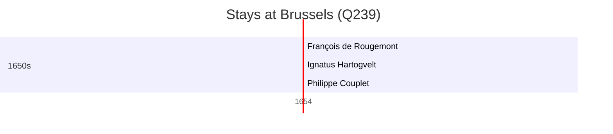

# Brussels (Q239)

*municipality in the Brussels-Capital Region and capital of Belgium*

Wikidata: [Q239](https://www.wikidata.org/wiki/Q239)

3 occurrence(s) across 1 transcribed value(s), 3 person(s).

**Transcribed variants:**

- `Bruxelas` (3×, 1654–1654)

| Date | Variant | Person | Type | Entity id | Real entity |
|------|---------|--------|------|-----------|-------------|
| 1654-11-25 | Bruxelas | François de Rougemont | jesuita-ordenacao-padre | [deh-francois-de-rougemont](deh-francois-de-rougemont) | — |
| 1654-11-25 | Bruxelas | Ignatus Hartogvelt | jesuita-ordenacao-padre | [deh-ignatus-hartogvelt](deh-ignatus-hartogvelt) | — |
| 1654-11-25 | Bruxelas | Philippe Couplet | jesuita-ordenacao-padre | [deh-philippe-couplet](deh-philippe-couplet) | [rp551005](rp551005) |

