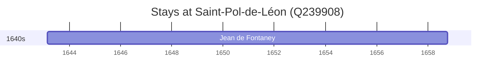

# Saint-Pol-de-Léon (Q239908)

*commune in Finistère, France*

Wikidata: [Q239908](https://www.wikidata.org/wiki/Q239908)

1 occurrence(s) across 1 transcribed value(s), 1 person(s).

**Transcribed variants:**

- `Diocese de S. Pol de Léon, Bretanha` (1×, 1643–1643)

| Date | Variant | Person | Type | Entity id | Real entity |
|------|---------|--------|------|-----------|-------------|
| 1643-02-17 | Diocese de S. Pol de Léon, Bretanha | Jean de Fontaney | nascimento | [deh-jean-de-fontaney](deh-jean-de-fontaney) | — |

