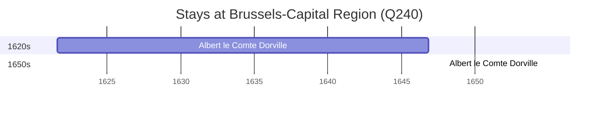

# Brussels-Capital Region (Q240)

*federal region of Belgium including the City of Brussels*

Wikidata: [Q240](https://www.wikidata.org/wiki/Q240)

2 occurrence(s) across 1 transcribed value(s), 1 person(s).

**Transcribed variants:**

- `Bruxelas` (2×, 1621–1654)

| Date | Variant | Person | Type | Entity id | Real entity |
|------|---------|--------|------|-----------|-------------|
| 1621-08-12 | Bruxelas | Albert le Comte Dorville | nascimento | [deh-albert-le-comte-dorville](deh-albert-le-comte-dorville) | — |
| 1654-07-02 | Bruxelas | Albert le Comte Dorville | jesuita-ordenacao-padre | [deh-albert-le-comte-dorville](deh-albert-le-comte-dorville) | — |

